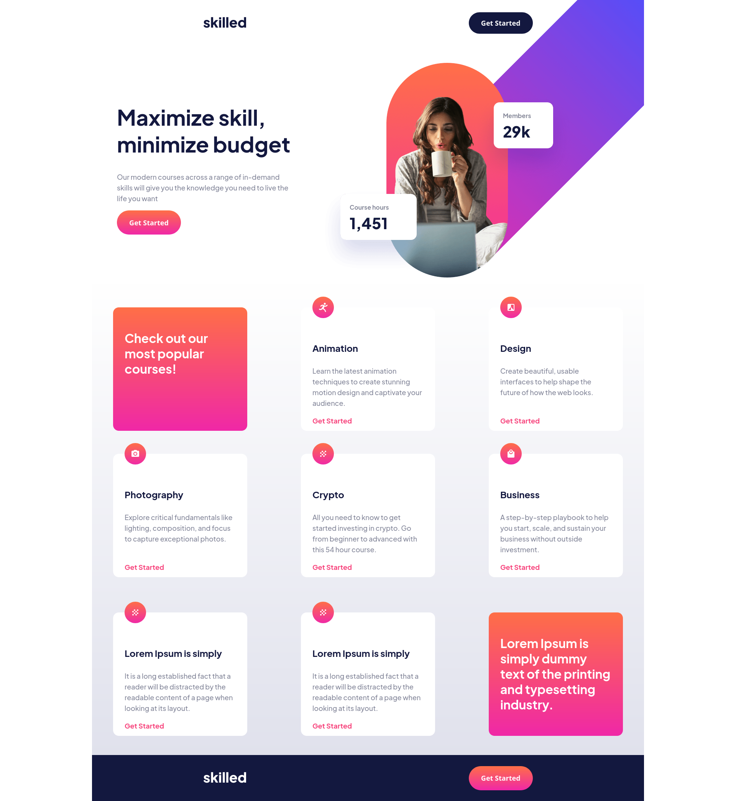

# Frontend Mentor - Skilled e-learning landing page solution

This is a solution to the [Skilled e-learning landing page challenge on Frontend Mentor](https://www.frontendmentor.io/challenges/skilled-elearning-landing-page-S1ObDrZ8q). Frontend Mentor challenges help you improve your coding skills by building realistic projects.

## Table of contents

- [Overview](#overview)
  - [The challenge](#the-challenge)
  - [Screenshot](#screenshot)
  - [Links](#links)
- [My process](#my-process)
  - [Built with](#built-with)
  - [What I learned](#what-i-learned)

  - [Useful resources](#useful-resources)
- [Author](#author)

## Overview

### The challenge

Users should be able to:

- View the optimal layout depending on their device's screen size
- See hover states for interactive elements

### Screenshot

### Links

- Solution URL: [Solution URL](https://github.com/zepolrepus/skilled-elearning-landing-page)
- Live Site URL: [Add live site URL here](https://your-live-site-url.com)

## My process

### Built with

- Semantic HTML5 markup
- CSS custom properties
- CSS Grid
- Mobile-first workflow
- [Astro](https://astro.build/)

### What I learned

First project with Astro.
 - Layout.
 - Components.

### Useful resources

- [Astro](https://docs.astro.build/en/getting-started/) - Astro Documentation.
- [CSS grid](https://css-tricks.com/snippets/css/complete-guide-grid/) - comprehensive guide to CSS grid

## Author

- Frontend Mentor - [@zepolrepus](https://www.frontendmentor.io/profile/zepolrepus)

